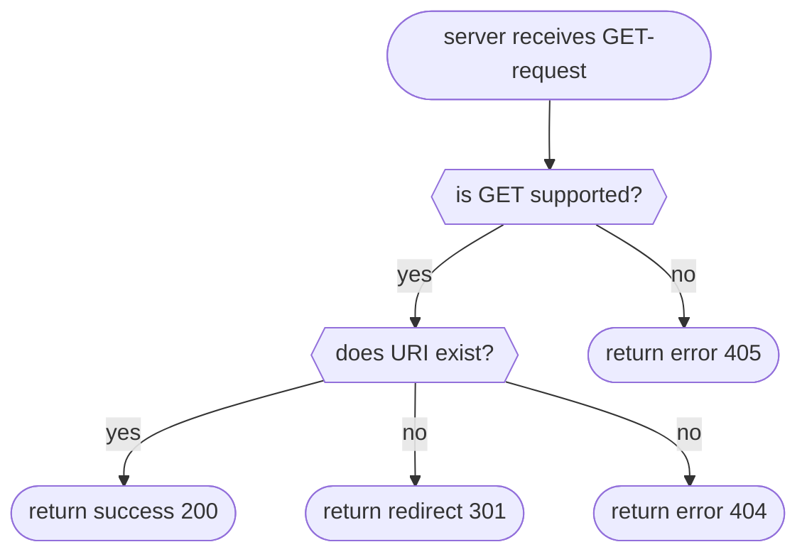

# GET

Returns data corresponding to a collection/folder.

!> This method does not define a content format. To list the contents of a collection in a machine-readable format, use
   other methods.

!> This method does not specify specific HTTP status codes, therefore they are handled the same as plain HTTP requests.



## 200: Success

<!-- panels:start -->
<!-- div:left-panel -->

The status code 200 is returned when the collection/folder was found.

Request:

```bash
curl -i --basic --user 'admin:password' -X GET 'http://localhost:8000/webdav/new_folder'
```

<!-- div:right-panel -->

Response

<!-- tabs:start -->

### **Dave**

```txt
HTTP/1.1 405 Method Not Allowed
Date: Sat, 12 Nov 2022 22:06:06 GMT
Content-Length: 18
Content-Type: text/plain; charset=utf-8

Method Not Allowed
```

### **Apache2**

```text
HTTP/1.1 301 Moved Permanently
Date: Sat, 12 Nov 2022 22:06:37 GMT
Server: Apache/2.4.37 (Unix)
Location: http://localhost:8001/webdav/new_folder/
Content-Length: 248
Content-Type: text/html; charset=iso-8859-1

<!DOCTYPE HTML PUBLIC "-//IETF//DTD HTML 2.0//EN">
<html><head>
<title>301 Moved Permanently</title>
</head><body>
<h1>Moved Permanently</h1>
<p>The document has moved <a href="http://localhost:8001/webdav/new_folder/">here</a>.</p>
</body></html>
```

Same request with trailing slash:

```text
HTTP/1.1 200 OK
Date: Sat, 12 Nov 2022 22:06:53 GMT
Server: Apache/2.4.37 (Unix)
Content-Length: 245
Content-Type: text/html;charset=ISO-8859-1

<!DOCTYPE HTML PUBLIC "-//W3C//DTD HTML 3.2 Final//EN">
<html>
 <head>
  <title>Index of /webdav/new_folder</title>
 </head>
 <body>
<h1>Index of /webdav/new_folder</h1>
<ul><li><a href="/webdav/"> Parent Directory</a></li>
</ul>
</body></html>
```

### **Nginx**

```txt
HTTP/1.1 301 Moved Permanently
Server: nginx/1.22.0
Date: Sat, 12 Nov 2022 22:07:29 GMT
Content-Type: text/html
Content-Length: 169
Location: http://localhost/webdav/new_folder/
Connection: keep-alive
Access-Control-Allow-Origin: *
Access-Control-Allow-Credentials: true
Access-Control-Allow-Methods: OPTIONS, GET, HEAD, POST, PUT, MKCOL, MOVE, COPY, DELETE, PROPFIND, PROPPATCH, LOCK, UNLOCK
Access-Control-Allow-Headers: Authorization,DNT,Keep-Alive,User-Agent,X-Requested-With,If-Modified-Since,Cache-Control,Content-Type,X-Accept-Charset,X-Accept,origin,accept,if-match,destination,overwrite
Access-Control-Expose-Headers: ETag
Access-Control-Max-Age: 1728000

<html>
<head><title>301 Moved Permanently</title></head>
<body>
<center><h1>301 Moved Permanently</h1></center>
<hr><center>nginx/1.22.0</center>
</body>
</html>
```

Same request with trailing slash:

```txt
HTTP/1.1 200 OK
Server: nginx/1.22.0
Date: Sat, 12 Nov 2022 22:07:54 GMT
Content-Type: text/html
Transfer-Encoding: chunked
Connection: keep-alive
Access-Control-Allow-Origin: *
Access-Control-Allow-Credentials: true
Access-Control-Allow-Methods: OPTIONS, GET, HEAD, POST, PUT, MKCOL, MOVE, COPY, DELETE, PROPFIND, PROPPATCH, LOCK, UNLOCK
Access-Control-Allow-Headers: Authorization,DNT,Keep-Alive,User-Agent,X-Requested-With,If-Modified-Since,Cache-Control,Content-Type,X-Accept-Charset,X-Accept,origin,accept,if-match,destination,overwrite
Access-Control-Expose-Headers: ETag
Access-Control-Max-Age: 1728000

<!DOCTYPE html><html><head><meta http-equiv="content-type" content="text/html; charset=utf-8"><meta name="viewport" content="width=device-width"><style type="text/css">body,html {background:#fff;font-family:"Bitstream Vera Sans","Lucida Grande","Lucida Sans Unicode",Lucidux,Verdana,Lucida,sans-serif;}tr:nth-child(even) {background:#f4f4f4;}th,td {padding:0.1em 0.5em;}th {text-align:left;font-weight:bold;background:#eee;border-bottom:1px solid #aaa;}#list {border:1px solid #aaa;width:100%;}a {color:#a33;}a:hover {color:#e33;}</style>

<title>Index of /webdav/new_folder/</title>
</head><body><h1>Index of /webdav/new_folder/</h1>
<table id="list"><thead><tr><th style="width:55%"><a href="?C=N&amp;O=A">File Name</a>&nbsp;<a href="?C=N&amp;O=D">&nbsp;&darr;&nbsp;</a></th><th style="width:20%"><a href="?C=S&amp;O=A">File Size</a>&nbsp;<a href="?C=S&amp;O=D">&nbsp;&darr;&nbsp;</a></th><th style="width:25%"><a href="?C=M&amp;O=A">Date</a>&nbsp;<a href="?C=M&amp;O=D">&nbsp;&darr;&nbsp;</a></th></tr></thead>
<tbody><tr><td class="link"><a href="../">Parent directory/</a></td><td class="size">-</td><td class="date">-</td></tr>
</tbody></table></body></html>
```

<!-- tabs:end -->
<!-- panels:end -->

## 404: URI not found

<!-- panels:start -->
<!-- div:left-panel -->

The status code 404 is returned when the collection/folder URI does not exist.

Request:

```bash
curl -i --basic --user 'admin:password' -X GET 'http://localhost:8000/webdav/folder/which/does/not/exist'
```

<!-- div:right-panel -->

Response

<!-- tabs:start -->

### **Dave**

```txt
HTTP/1.1 404 Not Found
Date: Sat, 12 Nov 2022 22:22:33 GMT
Content-Length: 9
Content-Type: text/plain; charset=utf-8

Not Found
```

### **Apache2**

```text
HTTP/1.1 404 Not Found
Date: Sat, 12 Nov 2022 22:22:49 GMT
Server: Apache/2.4.37 (Unix)
Content-Length: 232
Content-Type: text/html; charset=iso-8859-1

<!DOCTYPE HTML PUBLIC "-//IETF//DTD HTML 2.0//EN">
<html><head>
<title>404 Not Found</title>
</head><body>
<h1>Not Found</h1>
<p>The requested URL /webdav/folder/which/does/not/exist was not found on this server.</p>
</body></html>
```

### **Nginx**

```txt
HTTP/1.1 404 Not Found
Server: nginx/1.22.0
Date: Sat, 12 Nov 2022 22:23:04 GMT
Content-Type: text/html
Content-Length: 153
Connection: keep-alive
Access-Control-Allow-Origin: *
Access-Control-Allow-Credentials: true
Access-Control-Allow-Methods: OPTIONS, GET, HEAD, POST, PUT, MKCOL, MOVE, COPY, DELETE, PROPFIND, PROPPATCH, LOCK, UNLOCK
Access-Control-Allow-Headers: Authorization,DNT,Keep-Alive,User-Agent,X-Requested-With,If-Modified-Since,Cache-Control,Content-Type,X-Accept-Charset,X-Accept,origin,accept,if-match,destination,overwrite
Access-Control-Expose-Headers: ETag
Access-Control-Max-Age: 1728000

<html>
<head><title>404 Not Found</title></head>
<body>
<center><h1>404 Not Found</h1></center>
<hr><center>nginx/1.22.0</center>
</body>
</html>
```

<!-- tabs:end -->
<!-- panels:end -->

## References

- [RFC 4918: GET, HEAD for Collections](http://www.webdav.org/specs/rfc4918.html#n-get--head-for-collections)
