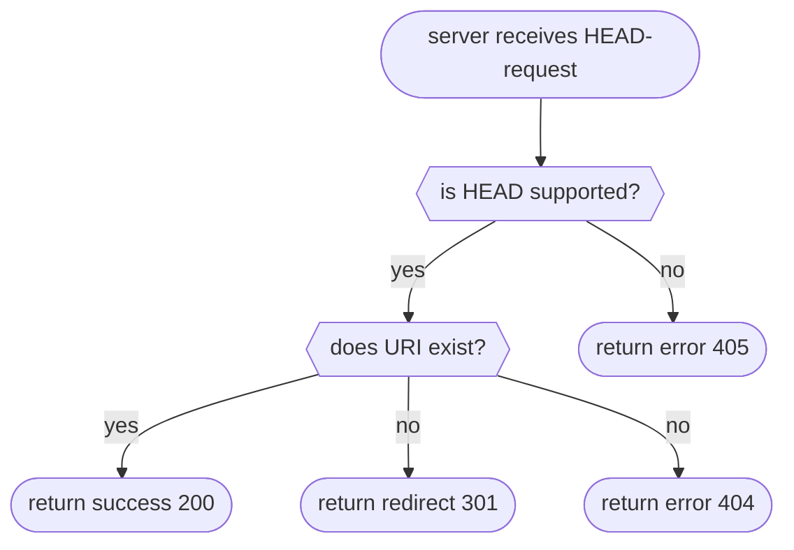

# HEAD

Identical to a GET request without the response body.

!> This method does not specify specific HTTP status codes, therefore they are handled the same as plain HTTP requests.



## 200: Success

<!-- panels:start -->
<!-- div:left-panel -->

The status code 200 is returned when the collection/folder was found.

Request:

```bash
curl -i --basic --user 'admin:password' --head 'http://localhost:8000/webdav/new_folder'
```

<!-- div:right-panel -->

Response

<!-- tabs:start -->

### **Dave**

```txt
HTTP/1.1 405 Method Not Allowed
Date: Sat, 12 Nov 2022 22:30:11 GMT
Content-Length: 18
Content-Type: text/plain; charset=utf-8
```

### **Apache2**

```text
HTTP/1.1 301 Moved Permanently
Date: Sat, 12 Nov 2022 22:30:26 GMT
Server: Apache/2.4.37 (Unix)
Location: http://localhost:8001/webdav/new_folder/
Content-Type: text/html; charset=iso-8859-1
```

Same request with trailing slash:

```text
HTTP/1.1 200 OK
Date: Sat, 12 Nov 2022 22:30:39 GMT
Server: Apache/2.4.37 (Unix)
Content-Type: text/html;charset=ISO-8859-1
```

### **Nginx**

```txt
HTTP/1.1 301 Moved Permanently
Server: nginx/1.22.0
Date: Sat, 12 Nov 2022 22:30:52 GMT
Content-Type: text/html
Content-Length: 169
Location: http://localhost/webdav/new_folder/
Connection: keep-alive
Access-Control-Allow-Origin: *
Access-Control-Allow-Credentials: true
Access-Control-Allow-Methods: OPTIONS, GET, HEAD, POST, PUT, MKCOL, MOVE, COPY, DELETE, PROPFIND, PROPPATCH, LOCK, UNLOCK
Access-Control-Allow-Headers: Authorization,DNT,Keep-Alive,User-Agent,X-Requested-With,If-Modified-Since,Cache-Control,Content-Type,X-Accept-Charset,X-Accept,origin,accept,if-match,destination,overwrite
Access-Control-Expose-Headers: ETag
Access-Control-Max-Age: 1728000
```

Same request with trailing slash:

```txt
HTTP/1.1 200 OK
Server: nginx/1.22.0
Date: Sat, 12 Nov 2022 22:31:06 GMT
Content-Type: text/html
Connection: keep-alive
Access-Control-Allow-Origin: *
Access-Control-Allow-Credentials: true
Access-Control-Allow-Methods: OPTIONS, GET, HEAD, POST, PUT, MKCOL, MOVE, COPY, DELETE, PROPFIND, PROPPATCH, LOCK, UNLOCK
Access-Control-Allow-Headers: Authorization,DNT,Keep-Alive,User-Agent,X-Requested-With,If-Modified-Since,Cache-Control,Content-Type,X-Accept-Charset,X-Accept,origin,accept,if-match,destination,overwrite
Access-Control-Expose-Headers: ETag
Access-Control-Max-Age: 1728000
```

<!-- tabs:end -->
<!-- panels:end -->

## 404: URI not found

<!-- panels:start -->
<!-- div:left-panel -->

The status code 404 is returned when the collection/folder URI does not exist.

Request:

```bash
curl -i --basic --user 'admin:password' --head 'http://localhost:8000/webdav/folder/which/does/not/exist'
```

<!-- div:right-panel -->

Response

<!-- tabs:start -->

### **Dave**

```txt
HTTP/1.1 404 Not Found
Date: Sat, 12 Nov 2022 22:31:27 GMT
Content-Length: 9
Content-Type: text/plain; charset=utf-8
```

### **Apache2**

```text
HTTP/1.1 404 Not Found
Date: Sat, 12 Nov 2022 22:31:40 GMT
Server: Apache/2.4.37 (Unix)
Content-Type: text/html; charset=iso-8859-1
```

### **Nginx**

```txt
HTTP/1.1 404 Not Found
Server: nginx/1.22.0
Date: Sat, 12 Nov 2022 22:31:54 GMT
Content-Type: text/html
Content-Length: 153
Connection: keep-alive
Access-Control-Allow-Origin: *
Access-Control-Allow-Credentials: true
Access-Control-Allow-Methods: OPTIONS, GET, HEAD, POST, PUT, MKCOL, MOVE, COPY, DELETE, PROPFIND, PROPPATCH, LOCK, UNLOCK
Access-Control-Allow-Headers: Authorization,DNT,Keep-Alive,User-Agent,X-Requested-With,If-Modified-Since,Cache-Control,Content-Type,X-Accept-Charset,X-Accept,origin,accept,if-match,destination,overwrite
Access-Control-Expose-Headers: ETag
Access-Control-Max-Age: 1728000
```

<!-- tabs:end -->
<!-- panels:end -->

## References

- [RFC 4918: GET, HEAD for Collections](http://www.webdav.org/specs/rfc4918.html#n-get--head-for-collections)
