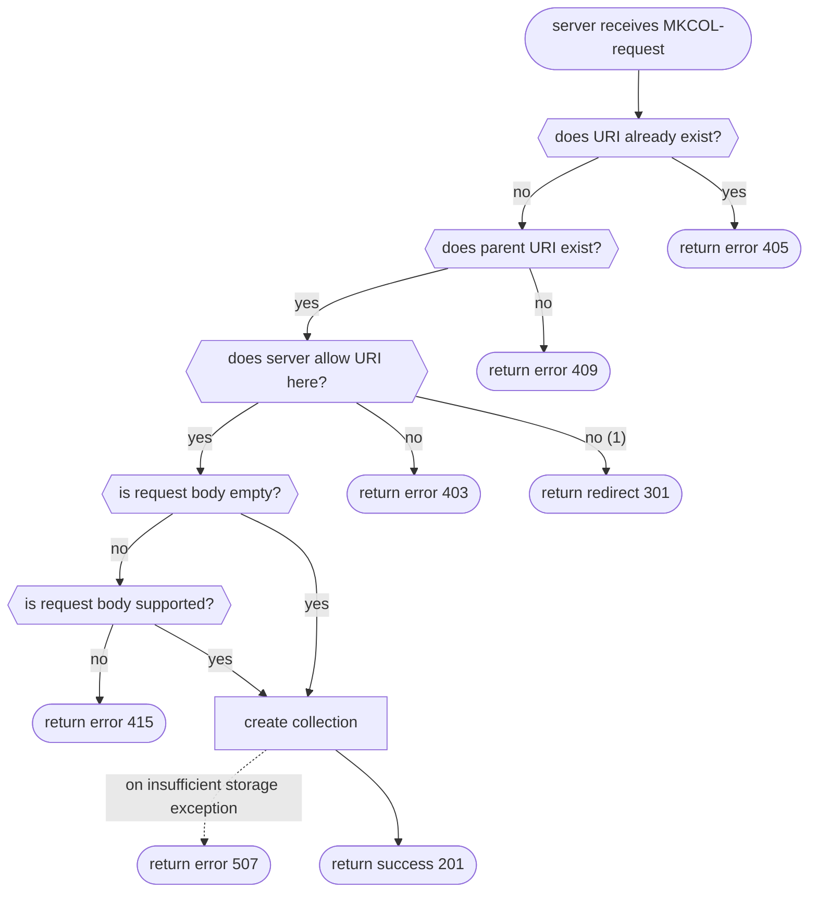

# MKCOL

Make collection. It is used to create collections/folders.



**Notes**:

1. The `301`-redirect is not directly mentioned in the standard, albeit it is sometimes used in the wild, e.g. by
   Apache.

## 201: Created

<!-- panels:start -->
<!-- div:left-panel -->

The status code 201 is returned when the collection/folder was successfully created.

Request:

```bash
curl -i --basic --user 'admin:password' -X MKCOL 'http://localhost:8000/webdav/new_folder'
```

<!-- div:right-panel -->

Response

<!-- tabs:start -->

### **Dave**

```txt
HTTP/1.1 201 Created
Date: Sat, 12 Nov 2022 15:44:09 GMT
Content-Length: 7
Content-Type: text/plain; charset=utf-8

Created
```

### **Apache2**

```text
HTTP/1.1 201 Created
Date: Sat, 12 Nov 2022 20:37:27 GMT
Server: Apache/2.4.37 (Unix)
Location: http://localhost:8001/webdav/new_folder
Content-Length: 192
Content-Type: text/html; charset=ISO-8859-1

<!DOCTYPE HTML PUBLIC "-//IETF//DTD HTML 2.0//EN">
<html><head>
<title>201 Created</title>
</head><body>
<h1>Created</h1>
<p>Collection /webdav/new_folder has been created.</p>
</body></html>
```

### **Nginx**

```txt
HTTP/1.1 201 Created
Server: nginx/1.22.0
Date: Sat, 12 Nov 2022 21:00:09 GMT
Content-Length: 0
Location: http://localhost/webdav/new_folder
Connection: keep-alive

// no response body
```

<!-- tabs:end -->
<!-- panels:end -->

## 405: URI path already exists

<!-- panels:start -->
<!-- div:left-panel -->

The status code 405 is returned when the collection/folder URI path already exists.

Request:

```bash
curl -i --basic --user 'admin:password' -X MKCOL 'http://localhost:8000/webdav/new_folder'
```

<!-- div:right-panel -->

Response

<!-- tabs:start -->

### **Dave**

```txt
HTTP/1.1 405 Method Not Allowed
Date: Sat, 12 Nov 2022 21:06:18 GMT
Content-Length: 18
Content-Type: text/plain; charset=utf-8

Method Not Allowed
```

### **Apache2**

```text
HTTP/1.1 301 Moved Permanently
Date: Sat, 12 Nov 2022 21:07:02 GMT
Server: Apache/2.4.37 (Unix)
Location: http://localhost:8001/webdav/new_folder/
Content-Length: 248
Content-Type: text/html; charset=iso-8859-1

<!DOCTYPE HTML PUBLIC "-//IETF//DTD HTML 2.0//EN">
<html><head>
<title>301 Moved Permanently</title>
</head><body>
<h1>Moved Permanently</h1>
<p>The document has moved <a href="http://localhost:8001/webdav/new_folder/">here</a>.</p>
</body></html>
```

!> Note: Status code 301 is returned because Apache expects trailing slashes, see also
[Stackoverflow](https://stackoverflow.com/a/131883).

### **Nginx**

```txt
HTTP/1.1 405 Not Allowed
Server: nginx/1.22.0
Date: Sat, 12 Nov 2022 21:08:29 GMT
Content-Type: text/html
Content-Length: 157
Connection: keep-alive

<html>
<head><title>405 Not Allowed</title></head>
<body>
<center><h1>405 Not Allowed</h1></center>
<hr><center>nginx/1.22.0</center>
</body>
</html>
```

<!-- tabs:end -->
<!-- panels:end -->

## 409: Parent URI path does not exist

<!-- panels:start -->
<!-- div:left-panel -->

The status code 409 is returned when the parent collection/folder URI path does not exist fully.

Request:

```bash
curl -i --basic --user 'admin:password' -X MKCOL 'http://localhost:8000/webdav/folder/which/does/not/exist'
```

<!-- div:right-panel -->

Response

<!-- tabs:start -->

### **Dave**

```txt
HTTP/1.1 409 Conflict
Date: Sat, 12 Nov 2022 21:25:22 GMT
Content-Length: 8
Content-Type: text/plain; charset=utf-8

Conflict
```

### **Apache2**

```text
HTTP/1.1 409 Conflict
Date: Sat, 12 Nov 2022 21:25:35 GMT
Server: Apache/2.4.37 (Unix)
Content-Length: 502
Content-Type: text/html; charset=iso-8859-1

<!DOCTYPE HTML PUBLIC "-//IETF//DTD HTML 2.0//EN">
<html><head>
<title>409 Conflict</title>
</head><body>
<h1>Conflict</h1>
<p>The server encountered an internal error or
misconfiguration and was unable to complete
your request.</p>
<p>Please contact the server administrator at 
 you@example.com to inform them of the time this error occurred,
 and the actions you performed just before this error.</p>
<p>More information about this error may be available
in the server error log.</p>
</body></html>
```

### **Nginx**

```txt
HTTP/1.1 409 Conflict
Server: nginx/1.22.0
Date: Sat, 12 Nov 2022 21:26:08 GMT
Content-Type: text/html
Content-Length: 151
Connection: keep-alive

<html>
<head><title>409 Conflict</title></head>
<body>
<center><h1>409 Conflict</h1></center>
<hr><center>nginx/1.22.0</center>
</body>
</html>
```

<!-- tabs:end -->
<!-- panels:end -->

## 415: Unsupported request body

<!-- panels:start -->
<!-- div:left-panel -->

The status code 415 is returned when the server does not support the request body.

Request:

```bash
curl -i --basic --user 'admin:password' -X MKCOL 'http://localhost:8000/webdav/another_folder' --upload-file - <<end
random data which is not supported
end
```

<!-- div:right-panel -->

Response

<!-- tabs:start -->

### **Dave**

```txt
HTTP/1.1 201 Created
Date: Sat, 12 Nov 2022 21:35:07 GMT
Content-Length: 7
Content-Type: text/plain; charset=utf-8
Connection: close

Created
```

!> Dave seems to ignore the request body.

### **Apache2**

```text
HTTP/1.1 415 Unsupported Media Type
Date: Sat, 12 Nov 2022 21:37:28 GMT
Server: Apache/2.4.37 (Unix)
Content-Length: 263
Connection: close
Content-Type: text/html; charset=iso-8859-1

<!DOCTYPE HTML PUBLIC "-//IETF//DTD HTML 2.0//EN">
<html><head>
<title>415 Unsupported Media Type</title>
</head><body>
<h1>Unsupported Media Type</h1>
<p>The supplied request data is not in a format
acceptable for processing by this resource.</p>
</body></html>
```

### **Nginx**

```txt
HTTP/1.1 415 Unsupported Media Type
Server: nginx/1.22.0
Date: Sat, 12 Nov 2022 21:37:58 GMT
Content-Type: text/html
Content-Length: 179
Connection: keep-alive

<html>
<head><title>415 Unsupported Media Type</title></head>
<body>
<center><h1>415 Unsupported Media Type</h1></center>
<hr><center>nginx/1.22.0</center>
</body>
</html>
```

<!-- tabs:end -->
<!-- panels:end -->

## References

- [RFC 4918: MKCOL Method](http://www.webdav.org/specs/rfc4918.html#METHOD_MKCOL)
