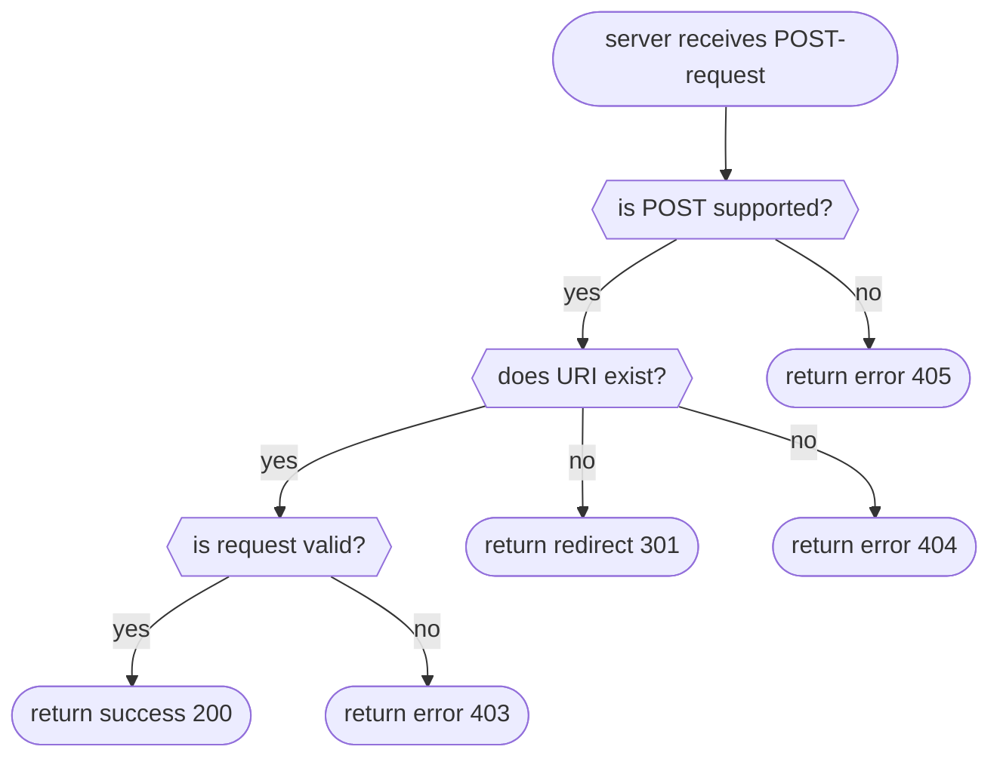

# POST

Returns data corresponding to a collection/folder.

!> This method does not define specific request/response bodies or status codes. POST is defined by the server and often
   depends on the particular resource.



## POST to new URI

<!-- panels:start -->
<!-- div:left-panel -->

Request:

```bash
curl -i --basic --user 'admin:password' -X POST 'http://localhost:8000/webdav/new_folder/' --upload-file - <<end
random data which is not supported
end
```

<!-- div:right-panel -->

Response

<!-- tabs:start -->

### **Dave**

```txt
HTTP/1.1 404 Not Found
Date: Sat, 12 Nov 2022 22:58:32 GMT
Content-Length: 9
Content-Type: text/plain; charset=utf-8
Connection: close

Not Found
```

### **Apache2**

```text
HTTP/1.1 100 Continue

HTTP/1.1 404 Not Found
Date: Sat, 12 Nov 2022 22:58:51 GMT
Server: Apache/2.4.37 (Unix)
Content-Length: 216
Content-Type: text/html; charset=iso-8859-1

<!DOCTYPE HTML PUBLIC "-//IETF//DTD HTML 2.0//EN">
<html><head>
<title>404 Not Found</title>
</head><body>
<h1>Not Found</h1>
<p>The requested URL /webdav/new_folder/ was not found on this server.</p>
</body></html>
```

### **Nginx**

```txt
HTTP/1.1 403 Forbidden
Server: nginx/1.22.0
Date: Sat, 12 Nov 2022 22:59:31 GMT
Content-Type: text/html
Content-Length: 153
Connection: keep-alive
Access-Control-Allow-Origin: *
Access-Control-Allow-Credentials: true
Access-Control-Allow-Methods: OPTIONS, GET, HEAD, POST, PUT, MKCOL, MOVE, COPY, DELETE, PROPFIND, PROPPATCH, LOCK, UNLOCK
Access-Control-Allow-Headers: Authorization,DNT,Keep-Alive,User-Agent,X-Requested-With,If-Modified-Since,Cache-Control,Content-Type,X-Accept-Charset,X-Accept,origin,accept,if-match,destination,overwrite
Access-Control-Expose-Headers: ETag
Access-Control-Max-Age: 1728000

<html>
<head><title>403 Forbidden</title></head>
<body>
<center><h1>403 Forbidden</h1></center>
<hr><center>nginx/1.22.0</center>
</body>
</html>
```

<!-- tabs:end -->
<!-- panels:end -->

## Post to existing URI

<!-- panels:start -->
<!-- div:left-panel -->

The status code 404 is returned when the collection/folder URI does not exist.

Request:

```bash
curl -i --basic --user 'admin:password' -X POST 'http://localhost:8002/webdav/existing_folder/' --upload-file - <<end
random data which is not supported
end
```

<!-- div:right-panel -->

Response

<!-- tabs:start -->

### **Dave**

```txt
HTTP/1.1 405 Method Not Allowed
Date: Sat, 12 Nov 2022 23:05:48 GMT
Content-Length: 18
Content-Type: text/plain; charset=utf-8
Connection: close

Method Not Allowed
```

### **Apache2**

```text
HTTP/1.1 301 Moved Permanently
Date: Sat, 12 Nov 2022 23:06:05 GMT
Server: Apache/2.4.37 (Unix)
Location: http://localhost:8001/webdav/existing_folder/
Content-Length: 253
Connection: close
Content-Type: text/html; charset=iso-8859-1

<!DOCTYPE HTML PUBLIC "-//IETF//DTD HTML 2.0//EN">
<html><head>
<title>301 Moved Permanently</title>
</head><body>
<h1>Moved Permanently</h1>
<p>The document has moved <a href="http://localhost:8001/webdav/existing_folder/">here</a>.</p>
</body></html>
```

Same request with trailing slash:

```txt
HTTP/1.1 100 Continue

HTTP/1.1 404 Not Found
Date: Sat, 12 Nov 2022 23:06:35 GMT
Server: Apache/2.4.37 (Unix)
Content-Length: 221
Content-Type: text/html; charset=iso-8859-1

<!DOCTYPE HTML PUBLIC "-//IETF//DTD HTML 2.0//EN">
<html><head>
<title>404 Not Found</title>
</head><body>
<h1>Not Found</h1>
<p>The requested URL /webdav/existing_folder/ was not found on this server.</p>
</body></html>
```

### **Nginx**

```txt
HTTP/1.1 301 Moved Permanently
Server: nginx/1.22.0
Date: Sat, 12 Nov 2022 23:07:00 GMT
Content-Type: text/html
Content-Length: 169
Location: http://localhost/webdav/existing_folder/
Connection: keep-alive
Access-Control-Allow-Origin: *
Access-Control-Allow-Credentials: true
Access-Control-Allow-Methods: OPTIONS, GET, HEAD, POST, PUT, MKCOL, MOVE, COPY, DELETE, PROPFIND, PROPPATCH, LOCK, UNLOCK
Access-Control-Allow-Headers: Authorization,DNT,Keep-Alive,User-Agent,X-Requested-With,If-Modified-Since,Cache-Control,Content-Type,X-Accept-Charset,X-Accept,origin,accept,if-match,destination,overwrite
Access-Control-Expose-Headers: ETag
Access-Control-Max-Age: 1728000

<html>
<head><title>301 Moved Permanently</title></head>
<body>
<center><h1>301 Moved Permanently</h1></center>
<hr><center>nginx/1.22.0</center>
</body>
</html>
```

Same request with trailing slash:

```txt
HTTP/1.1 403 Forbidden
Server: nginx/1.22.0
Date: Sat, 12 Nov 2022 23:07:40 GMT
Content-Type: text/html
Content-Length: 153
Connection: keep-alive
Access-Control-Allow-Origin: *
Access-Control-Allow-Credentials: true
Access-Control-Allow-Methods: OPTIONS, GET, HEAD, POST, PUT, MKCOL, MOVE, COPY, DELETE, PROPFIND, PROPPATCH, LOCK, UNLOCK
Access-Control-Allow-Headers: Authorization,DNT,Keep-Alive,User-Agent,X-Requested-With,If-Modified-Since,Cache-Control,Content-Type,X-Accept-Charset,X-Accept,origin,accept,if-match,destination,overwrite
Access-Control-Expose-Headers: ETag
Access-Control-Max-Age: 1728000

<html>
<head><title>403 Forbidden</title></head>
<body>
<center><h1>403 Forbidden</h1></center>
<hr><center>nginx/1.22.0</center>
</body>
</html>
```

<!-- tabs:end -->
<!-- panels:end -->

## References

- [RFC 4918: POST for Collections](http://www.webdav.org/specs/rfc4918.html#METHOD_POST)
